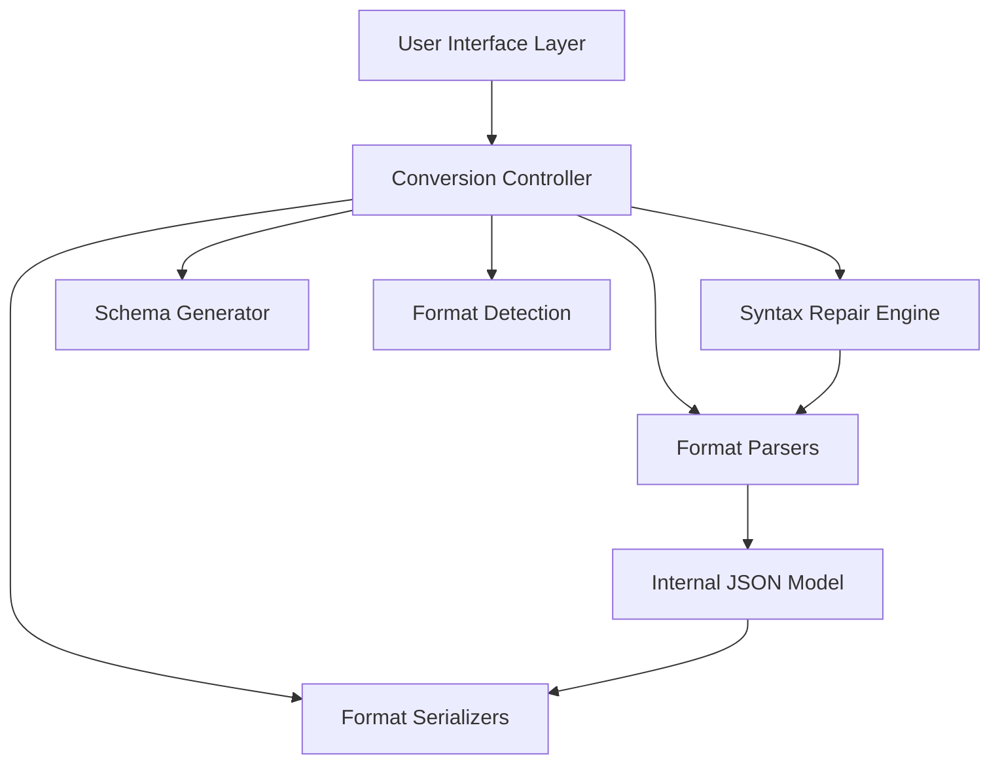

# Design Document

## Overview

The Universal Data Format Converter is a client-side single-page web application built with React and TypeScript. The system uses a hub-and-spoke architecture where JSON serves as the universal internal representation, with dedicated parsers and serializers for each supported format (YAML, XML, CSV). All processing occurs locally in the browser using established parsing libraries, ensuring data privacy and offline functionality.

The application features a three-pane interface with real-time conversion, automatic syntax repair, schema generation capabilities, and intelligent format detection. The modular architecture allows for easy extension to additional formats while maintaining consistent conversion behavior through property-based testing.

## Architecture

### High-Level Architecture



### Core Design Principles

1. **JSON as Universal Hub**: All conversions flow through a canonical JSON representation
2. **Client-Side Only**: No server dependencies, all processing in browser
3. **Modular Parsers/Serializers**: Each format has dedicated, swappable components
4. **Fail-Safe Operations**: Graceful error handling with user-friendly messages
5. **Performance First**: Optimized for sub-100ms conversion times on typical data

## Components and Interfaces

### Format Parser Interface

```typescript
interface FormatParser {
  parse(input: string): ParseResult;
  canParse(input: string): boolean;
  getFormatName(): SupportedFormat;
}

interface ParseResult {
  success: boolean;
  data?: any;
  errors?: ParseError[];
  warnings?: string[];
}
```

### Format Serializer Interface

```typescript
interface FormatSerializer {
  serialize(data: any, options?: SerializationOptions): SerializationResult;
  getFormatName(): SupportedFormat;
  getDefaultOptions(): SerializationOptions;
}

interface SerializationResult {
  success: boolean;
  output?: string;
  errors?: string[];
  warnings?: string[];
}
```

### Conversion Controller

```typescript
interface ConversionController {
  convert(input: string, fromFormat: SupportedFormat, toFormat: SupportedFormat): ConversionResult;
  autoDetectFormat(input: string): FormatDetectionResult;
  repairSyntax(input: string, format: SupportedFormat): RepairResult;
  generateSchema(jsonData: any, schemaType: 'typescript' | 'json-schema'): SchemaResult;
}
```

### Syntax Repair Engine

```typescript
interface SyntaxRepairEngine {
  repairJson(input: string): RepairResult;
  repairYaml(input: string): RepairResult;
  repairXml(input: string): RepairResult;
  repairCsv(input: string): RepairResult;
}

interface RepairResult {
  success: boolean;
  repairedText?: string;
  issuesFound: RepairIssue[];
  appliedFixes: string[];
}
```

## Data Models

### Core Data Types

```typescript
type SupportedFormat = 'json' | 'yaml' | 'xml' | 'csv';

interface ConversionRequest {
  input: string;
  fromFormat: SupportedFormat;
  toFormat: SupportedFormat;
  options?: ConversionOptions;
}

interface ConversionOptions {
  prettyPrint?: boolean;
  indentSize?: number;
  csvOptions?: CsvOptions;
  repairSyntax?: boolean;
}

interface CsvOptions {
  hasHeaders?: boolean;
  delimiter?: string;
  enableTypeDetection?: boolean;
  treatFirstRowAsHeaders?: boolean;
}
```

### Error and Result Models

```typescript
interface ParseError {
  line: number;
  column: number;
  message: string;
  severity: 'error' | 'warning';
}

interface ConversionResult {
  success: boolean;
  output?: string;
  errors?: ParseError[];
  warnings?: string[];
  metadata?: ConversionMetadata;
}

interface ConversionMetadata {
  inputFormat: SupportedFormat;
  outputFormat: SupportedFormat;
  processingTime: number;
  dataSize: number;
  repairApplied: boolean;
}
```

## Correctness Properties

*A property is a characteristic or behavior that should hold true across all valid executions of a system-essentially, a formal statement about what the system should do. Properties serve as the bridge between human-readable specifications and machine-verifiable correctness guarantees.*

Based on the prework analysis, I can identify several redundant properties that should be consolidated:

**Property Reflection:**
- Properties 1.1-1.6 all test round-trip conversion consistency and can be combined into a single comprehensive round-trip property
- Properties 2.1-2.4 all test syntax repair for different error types and can be combined into a comprehensive syntax repair property  
- Properties 4.1-4.4 all test format detection accuracy and can be combined into a single format detection property
- Properties 5.1, 5.3-5.5 all test pretty-printing behavior and can be combined
- Properties 6.1-6.3 all test CSV type detection and can be combined
- Properties 7.1-7.5 all test error handling and can be combined into comprehensive error handling properties

### Property 1: Round-trip conversion consistency
*For any* valid data in a supported format, converting to any other supported format and back should preserve the semantic content within the constraints of the target format
**Validates: Requirements 1.1, 1.2, 1.3, 1.4, 1.5, 1.6**

### Property 2: Syntax repair effectiveness  
*For any* data with common syntax errors (missing commas, trailing commas, unclosed quotes, mismatched brackets), the syntax repair engine should produce valid, parseable output
**Validates: Requirements 2.1, 2.2, 2.3, 2.4**

### Property 3: Repair reporting completeness
*For any* syntax repair operation, the system should report all issues found and fixes applied
**Validates: Requirements 2.5**

### Property 4: Schema generation validity
*For any* valid JSON object, generated TypeScript interfaces and JSON schemas should be syntactically valid and accurately represent the input structure
**Validates: Requirements 3.1, 3.2, 3.3, 3.4**

### Property 5: Format detection accuracy
*For any* valid input in a supported format, the auto-detection system should correctly identify the format
**Validates: Requirements 4.1, 4.2, 4.3, 4.4**

### Property 6: Pretty-printing preservation
*For any* valid data, pretty-printing should maintain semantic equivalence while improving readability with proper formatting
**Validates: Requirements 5.1, 5.3, 5.4, 5.5**

### Property 7: Minification preservation
*For any* valid formatted data, minification should preserve semantic content while removing unnecessary whitespace
**Validates: Requirements 5.2**

### Property 8: CSV type detection consistency
*For any* CSV data with type detection enabled, the same column should receive consistent type treatment across all rows
**Validates: Requirements 6.1, 6.2, 6.3, 6.5**

### Property 9: CSV header processing
*For any* CSV data with headers enabled, the first row should be used as property names in the resulting JSON structure
**Validates: Requirements 6.4**

### Property 10: Error message informativeness
*For any* parsing failure, error messages should include specific location information (line/column) and helpful descriptions
**Validates: Requirements 7.1, 7.2**

### Property 11: Data loss warnings
*For any* conversion that may lose data due to format constraints, appropriate warnings should be provided to the user
**Validates: Requirements 7.3**

### Property 12: Problem highlighting
*For any* validation issues, the system should identify and highlight problematic sections in the input
**Validates: Requirements 7.4**

### Property 13: Repair preview accuracy
*For any* auto-repair operation, the preview of proposed changes should accurately reflect what will be applied
**Validates: Requirements 7.5**

## Error Handling

### Error Categories

1. **Parse Errors**: Invalid syntax in input data
   - JSON: Malformed objects, arrays, strings
   - YAML: Indentation errors, invalid syntax
   - XML: Unclosed tags, invalid characters
   - CSV: Inconsistent column counts, encoding issues

2. **Conversion Errors**: Data structures incompatible with target format
   - Complex nested objects to CSV (flattening required)
   - Binary data in text formats
   - Circular references in JSON

3. **System Errors**: Browser limitations or resource constraints
   - Memory exhaustion on large datasets
   - Browser compatibility issues
   - Local storage limitations

### Error Recovery Strategy

```typescript
interface ErrorRecoveryStrategy {
  attemptRepair: boolean;
  fallbackFormat?: SupportedFormat;
  userPromptRequired: boolean;
  preservePartialResults: boolean;
}
```

### User Experience for Errors

- **Progressive Disclosure**: Show summary first, details on demand
- **Actionable Messages**: Suggest specific fixes where possible
- **Context Preservation**: Maintain user input even when errors occur
- **Recovery Options**: Offer repair, format change, or manual editing

## Testing Strategy

### Dual Testing Approach

The system will employ both unit testing and property-based testing to ensure comprehensive coverage:

**Unit Testing:**
- Specific examples demonstrating correct behavior
- Edge cases like empty inputs, single values, deeply nested structures
- Integration points between parsers, serializers, and the conversion controller
- Error conditions and boundary cases

**Property-Based Testing:**
- Universal properties that should hold across all valid inputs
- Round-trip conversion consistency across random data structures
- Syntax repair effectiveness on randomly generated malformed data
- Format detection accuracy on randomly generated valid format samples

### Property-Based Testing Configuration

- **Library**: fast-check for JavaScript/TypeScript property-based testing
- **Iterations**: Minimum 100 iterations per property test to ensure statistical confidence
- **Test Tagging**: Each property-based test must include a comment with the format: `**Feature: universal-data-converter, Property {number}: {property_text}**`
- **Single Implementation**: Each correctness property must be implemented by exactly one property-based test

### Test Data Generation Strategy

- **Smart Generators**: Create generators that produce valid data within realistic constraints
- **Format-Specific Generators**: Separate generators for JSON, YAML, XML, and CSV structures
- **Error Injection**: Generators for common syntax errors to test repair functionality
- **Boundary Testing**: Generators for edge cases like empty data, very large structures, special characters

### Coverage Requirements

- **Unit Tests**: Cover specific examples, error conditions, and integration points
- **Property Tests**: Verify universal correctness properties hold across all inputs
- **Integration Tests**: End-to-end conversion workflows
- **Performance Tests**: Ensure sub-100ms conversion times on typical datasets

The combination of unit and property-based tests provides comprehensive coverage where unit tests catch concrete bugs and property tests verify general correctness across the input space.

## Implementation Notes

### Technology Stack

- **Frontend Framework**: React 18 with TypeScript
- **Build Tool**: Vite for fast development and optimized builds
- **Parsing Libraries**:
  - JSON: Native browser JSON API
  - YAML: js-yaml library
  - XML: fast-xml-parser library  
  - CSV: papaparse library
- **Schema Generation**: Custom implementation with TypeScript AST generation
- **Testing**: Jest for unit tests, fast-check for property-based testing

### Performance Considerations

- **Lazy Loading**: Load parsing libraries only when needed
- **Web Workers**: Consider offloading heavy parsing to background threads
- **Memory Management**: Implement cleanup for large dataset processing
- **Caching**: Cache parsed results for repeated operations

### Browser Compatibility

- **Target**: Modern browsers with ES2020 support
- **Fallbacks**: Polyfills for older browsers if needed
- **Progressive Enhancement**: Core functionality works without advanced features

### Security Considerations

- **Content Security Policy**: Strict CSP to prevent XSS
- **Input Sanitization**: Validate all user input before processing
- **Local Processing**: No data transmission to external servers
- **Memory Limits**: Prevent memory exhaustion attacks with large inputs